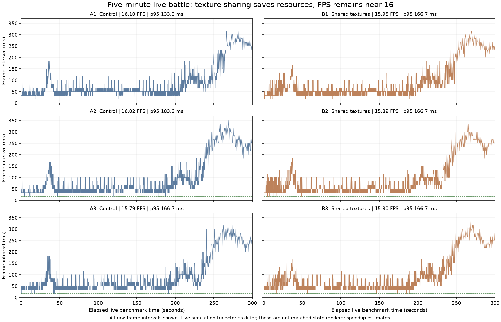

# Three live pairs: resource/loading win, no demonstrated FPS gain

Six actual Menu runs completed their full300-second LIVE camera window with all
validity checks passing. The sequence was A1,B1,B2,A2,A3,B3; A is fixed397173a0,
B is fixedad8c218a. All started at tick9000 with the canonical contact-state hash.
Viewport1440×900, DPR2, normal content and single shadows were preserved. Owned
agents/builds/tests and other GPU jobs were terminal throughout timing. Build-file
hashes were checked before/after each run. No sample was discarded or rerun.

| Run | Average FPS | 1% low FPS | p95 frame ms | Final tick | First ready s |
| --- | ---: | ---: | ---: | ---: | ---: |
| A1 | 16.10 | 3.49 | 133.33 | 16080 | 4.513 |
| B1 | 15.95 | 3.45 | 166.66 | 16439 | 3.486 |
| B2 | 15.89 | 3.43 | 166.66 | 16535 | 3.553 |
| A2 | 16.02 | 3.26 | 183.32 | 16491 | 4.652 |
| A3 | 15.79 | 3.39 | 166.66 | 16457 | 4.686 |
| B3 | 15.80 | 3.35 | 166.66 | 16512 | 3.518 |

The95% texture-payload reduction is a hardware-proven resource saving. First
readiness, observed on the battle document before benchmark pre-roll, improves
by about1.0–1.2seconds in every pair. It is initial loading/readiness wall time,
not isolated image-upload GPU time.

No frame-rate improvement is demonstrated. Averages occupy15.79–16.10FPS,
with inconsistent tail deltas. Final ticks differ, so these are not matched-state
renderer speedup estimates. Every run fails the normal60FPS/cadence goal.
The source Three baseline and final net-shadow equation remain separate open gates.

## Next bottleneck evidence

Across these runs, measured render CPU p95 is10.46–11.28ms. Main-world GPU stage
median is about25ms and p95 about40ms; post stage median is about9ms. Pose and
grass classification medians are each about0.6ms. These stage intervals overlap
and must not be added. The observed whole-submission interval union p95 is
43.65–46.34ms; this excludes unqueried copies/queue wait and is not physical GPU
busy-time telemetry. One final query is unresolved in A1; the other runs have
none. No cursor gaps or lost events.

Awaited presentation wall time is much larger than the instrumented CPU work,
especially in combined/return phases (p95 roughly196–267ms). It includes library
continuations and must not be relabeled GPU wait. Frame scheduling requests the
next rAF only after that promise settles. The next investigation must attribute
main-world/fullscreen GPU work and asynchronous presentation stalls, using
matched-state diagnostics and a browser CPU trace before proposing another fix.
The paused-state camera reuse candidate alone cannot explain or solve these live
costs. Simulation tick p95 also exceeds33.33ms; sustained simulation remains open.

Raw reports are losslessly compressed with SHA256s in `archives.json`; each
contains every frame and submission-matched GPU result. `analysis.json.gz` preserves
phase distributions and sampled camera/tick history. Quantiles use nearest rank;
no CPU/GPU percentile sums are used. The runner and compiled controls remain under
`throwaway/typegpu-image-sharing/` in the implementation worktree.
