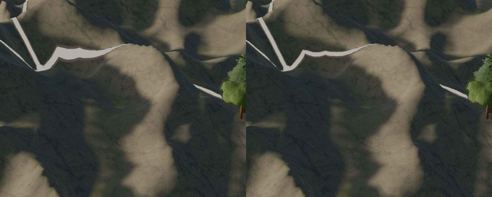

# Roads keep their width across slopes

Accepted for local road-width consistency. The close Alpine road loses its broad
scalloped flare while its route and junction stay connected. This does not accept
road color, every bend, mountain form, vegetation or the whole landscape.

The builder supplies original road centers alongside its existing vertices.
Geographic seating preserves the intended width perpendicular to the local
surface route. Caps use the same distance meaning. Replacement terrain always
starts from those original inputs; routing, water gaps, scale settings, colors
and clearances remain unchanged.

Production comparison uses merged runtime 72177093 (maintenance 34a61018 only
changes docs), 1280×800/DPR1, paused tick 0, natural view, no fog and identical
Alps/Italy/close-Alps cameras. Full frames are under `control/` and `candidate/`.
`production-delta.json` isolates the road change; `repeat.json` records three exact
repeats on the final code after the fog-upload correction. The close comparison
places control on the left and candidate on the right.

All 1,064 frontend tests and typecheck pass, including eight geographic tests.
Independent code review found a partial-fog-upload regression; the fix preserves
full region uploads and both update orders now pass. Fresh production and
geographic image reviews prefer the candidate, with no visible new route or border
defect. [Review scope and memory cost](review.md) and the [test ledger](test-changes.md)
record the limits.

The geography verifier previously trusted readiness from the preceding camera.
`readiness-before.json` shows terrain changing during its Alps screenshot;
`readiness-after.json` keeps all toggles at revision 32. Its exact pixel gate is
unchanged. Stored geography images also predated several accepted terrain passes;
`geography-delta.json` separates that older drift from this road change.
