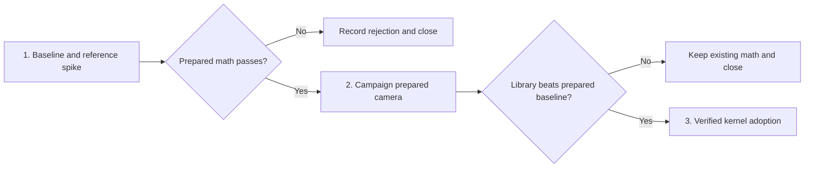

# Measured CPU math optimization

Use the installed [pmndrs math skill](../../.agents/skills/math/SKILL.md) to
reduce repeated browser CPU work while preserving game behavior. Start with
campaign camera projection, where the code visibly repeats matrix preparation.
Adopt the npm library only if it improves the prepared existing-math baseline.
The admitted prototype removes repeated matrix work; shipped-code verification is in progress.

## Next Agent Prompt

The prepared camera implementation is verified and ready for final archive.
All three slices have accepted or evidence-backed rejected outcomes. Finish the
whole-spec documentation audit and archive with close-spec; no implementation
work remains. Keep the consolidated choices ledger and explicit limits.

The shipped primitive replay passes all 14 projection CPU gates over five
pairs (2.55–4.25 ms saved per captured batch); the actual world-method comparison
passes all six held-view/DPR whole-frame gates with identical workload settings.
The final 14-case live probe passes. Allocation and GC-attributed samples are
lower. Full web tests pass with four workers, as do typecheck, lint and build.
Real pre-draw resize/picking/two-world browser checks pass. Independent reviews
are clean after fixing constructor-bypassing test fixtures.

Six current before/after images are identical. Five historical canonical
snapshot failures remain unchanged and disclosed; the remaining checks in the
exercised scenes pass. The nonblocking Preview checkpoint is complete and owned
images are closed. Preserve this evidence boundary. Raw evidence lives in
ignored throwaway/math-optimization; no npm dependency is installed.

- [x] Install upstream skill locally, preserve its bytes/license/provenance.
- [x] [1 — measure and reproduce](slices/01-measure-and-reproduce.md): report
  baseline, API compatibility, work-removal control, and provisional candidates.
- [x] [2 — prepare campaign camera](slices/02-prepare-campaign-camera.md): ship
  only if the existing-math candidate passes; verify placement and picking.
- [x] [3 — evaluate library kernels](slices/03-evaluate-library-kernels.md):
  rejected by the incremental CPU gate; no npm dependency. Clean experiments
  and close out after slice 2.

Update this prompt, the checklist, and the owning slice's result before ending
each pass. Record commands, evidence locations, limitations, and exact next
pickup point. Reslice before accepting an unlisted architectural decision.

## Scope agreed with the user

Behavior-preserving browser CPU optimizations, first measured on real workloads.
No compatibility shims or migrations. The user subsequently invoked implement-spec to execute this ladder. The skill is shared with
Claude through the repo's existing `.claude/skills` symlink. Installing it does
not install `math` as a runtime dependency.

Sacred contracts are camera/picking/label behavior, current visual quality,
deterministic simulation, and existing numeric tolerances. No changes to Rust
simulation, unit stats, shaders, terrain density, LOD policy, shadows, resolution,
random sequences, save data, or Three version. No scene-wide transform extension
and no wholesale replacement of Three vectors. No art or other external assets
are needed; deterministic fixtures come from existing production inputs.

## Where the skill is useful

| Candidate | Evidence and intended use | Decision |
| --- | --- | --- |
| Campaign projection and rays | [camera3d](../../packages/renderer-core/src/camera3d.ts) rebuilds matrices per point/ray; [campaignWorld](../../packages/photoreal-renderer/src/campaign/campaignWorld.ts) consumes these for labels, markers, anchors, picking and city bounds. Use caller-owned prepared state, hoist camera-invariant work, then compare math kernels. | First measured target; not yet a proven dominant bottleneck. |
| Uniform preparation and shadow footprint rays | [cameraUniform](../../packages/renderer-core/src/cameraUniform.ts) reconstructs VP during inverse construction; [sunShadow](../../packages/photoreal-renderer/src/landscape/sunShadow.ts) repeats corner unprojections. | Plausible later consumers of the same prepared state. Defer until their actual cost justifies a separate integration slice. |
| Crowd visibility and transforms | [visibility](../../packages/crowd-runtime/src/visibility.ts) already uses scalar arithmetic and reusable output buffers. The skill can guide stable input shapes, cached class bounds and setup-time metadata. | Profile first; tuple conversion may lose. Do not replace existing loops or change LOD/culling policy in this ladder. |
| Terrain picking | [terrainPicking](../../packages/battle-renderer/src/terrainPicking.ts) already has a BVH and scalar intersection kernels. Its traversal workspace is a possible allocation target. | Defer; preserve nearest front-face hit and boundary semantics. A generic library intersection is not automatically equivalent. |
| Label bounds | [labelLayout](../../packages/game-renderer/src/campaign/labelLayout.ts) has bounds calculations worth measuring, but layout and atlas work may dominate. | Separate ownership problem; no label arbitration or atlas rewrite here. |

The [prior battle performance report](../../web/reports/battle-zoom-performance.md)
found meaningful GPU grass work and noisy timings. It does not demonstrate a
CPU math bottleneck. Faster math must not be credited for fewer triangles,
lower resolution, different visible membership, or weaker visual quality.

## Slice graph and review map

The first artifact is an evidence report, the second is a playable campaign
with preserved labels/picking, and the third is an independently attributable
library verdict. Keep these decisions separate: fewer matrix constructions
and faster individual operations are different gains.

Use the current scene harness and campaign composition route. No new app,
generic math abstraction, benchmark framework, or standalone visualization is
needed for these contracts. Source experiments and raw captures belong in
ignored `throwaway/math-optimization/`; maintain only the repeatable probe and
concise conclusions. The exact slice contracts own their implementation detail.

## Single-owner invariants

- `camera3d.ts` owns projection semantics and screen/world conversion;
  `mat4.ts` owns low-level matrix operations. A prepared path shares this
  arithmetic; it cannot become a separate campaign projection implementation.
- Each campaign world owns its prepared state. The existing `setFrameCamera`
  is the update boundary, including pre-draw card queries. Independent worlds
  cannot overwrite one another; no global camera scratch or hidden cache.
- Existing camera rigs and callers own pose, aspect, and CSS/device-pixel
  conversion. Keep all precision, reverse-Z, finite/infinite far, and output
  lifetime contracts. GPU storage remains typed arrays with unchanged layouts.
- Existing terrain, label, and crowd modules keep their semantic policies.
  Math functions do not decide visibility budgets, terrain height, or labels.
- Experiments have no production consumers. Remove losing candidate paths at
  their verdict; cold-call APIs survive only when they remain real APIs sharing
  the same implementation, not as compatibility scaffolding.

This is the refactor-clean end state: one projection owner with reusable state,
not a library-specific second camera or an adapter beside every caller.

## Performance admission

Freeze the workload, camera path, baseline commit, browser/build, machine/GPU,
viewport/DPR, quality settings, seed, visible counts and sample duration before
candidate comparisons. Record first traversal separately from warmed work.
Reuse the [battle benchmark's measurement principles](../../docs/battle-benchmark.md)
and the existing [CPU profile](../../web/scenes/battle/battle-cpu-profile.mjs),
[camera trace](../../web/scenes/battle/battle-camera-performance.mjs), and
[full-game report](../../web/scenes/system/full-game-rendering-performance.mjs).
Add the campaign workload to the new probe rather than treating battle timing
as evidence about campaign labels.

Use at least five interleaved baseline/candidate pairs in otherwise quiet
hardware Chrome. Use warmed windows of at least five seconds; record frame
counts, workload call counts, CPU stage median/p95, total-frame median/p95,
allocation/GC evidence, and setup time. A benchmark that repeats a batch many
times must normalize back to its actual per-frame workload. Measure CPU timing
without a sampling profiler attached; use separate sampled runs for attribution.

Admission policy, fixed before candidate runs:

- The representative camera workload saves **at least 0.25 ms and 10%** in
  median CPU time, exceeding the range of baseline-run medians, and wins in at
  least four of five pairs. These are planning thresholds, not measured facts.
- No reproducible full-frame p95 regression above the larger of baseline-run
  p95 noise, 0.5 ms, or 5%. Reproduction means it occurs in two controlled pairs.
  Reject input latency, allocation/GC, correctness, or visual regressions even
  when an isolated median improves.
- A library candidate must meet the same admission policy **against prepared
  existing math**, including conversion costs. If only work removal wins, keep
  the dependency-free implementation and attribute the gain correctly.
- Software-rendered results establish correctness/liveness only. Headless
  Chrome using a verified hardware adapter can establish relative CPU and rAF
  results, but not physical presentation or input-to-display latency. Inconclusive
  hardware evidence is not a pass. Repeat once under controlled conditions,
  then defer if uncertainty remains. Do not weaken gates after seeing results.

Use `VERIFY_GPU=1 VERIFY_GPU_ADAPTER=hardware VERIFY_BROWSER_CHANNEL=chrome`
with scene commands. Report CPU-stage and full-frame outcomes separately;
improved CPU cost under a GPU bottleneck is not a promised FPS increase.

## Correctness and visual acceptance

Relevant existing contracts live in the web tests for `camera3d`,
`cameraUniform`, `photorealCamera`, `campaignCameraDpr`, `campaignPicking`, and
`campaignLabelProjection`. Slice 2 adds the missing prepared-state lifecycle
coverage through consumers. Do not merely compare two implementations of the
same formula; retain geometric and real input/resize/picking expectations.
Discrete visibility and picking decisions must agree exactly, and continuous
coordinates must stay within the existing tolerances. No baseline re-blessing
to hide drift. Full web tests, typecheck, lint, and build gate shipped changes.

Every slice that produces a visual shot must run
[compare-screenshots](../../.agents/skills/compare-screenshots/SKILL.md) on matched
baseline/candidate captures, then an unprimed
[screenshot-critique](../../.agents/skills/screenshot-critique/SKILL.md) as its last
visual acceptance check. Preserve current scene snapshot thresholds. Check
warnings/errors as well as pixels; a live route is not proof of correct drawing.

Human checkpoints are non-blocking. Open relevant captures together with
[preview-shots](../../.agents/skills/preview-shots/SKILL.md), provide roughly five
minutes for feedback while doing independent work, then decide from the evidence
if no reply arrives. Record the decision and rationale, close the opened shots,
and continue. Silence is not proof of correctness and cannot override a failed
gate. User feedback on placement, picking, or latency can reject a reversible
candidate even if the benchmark passes.

## Research

Primary sources were inspected at upstream commit
`983a607676026c5f1b950f876bc688988de824e5`:

- [Upstream skill](https://github.com/pmndrs/math/blob/983a607676026c5f1b950f876bc688988de824e5/skills/math/SKILL.md): caller-owned output, stable storage, allocation and interop guidance. Installed unmodified with [provenance/license](../../.agents/skills/math/SOURCE.md).
- [Package exports](https://github.com/pmndrs/math/blob/983a607676026c5f1b950f876bc688988de824e5/package.json): version 0.1.0, no `math/three`. Validate the published artifact rather than assuming skill/source/package parity.
- [Matrix implementation](https://github.com/pmndrs/math/blob/983a607676026c5f1b950f876bc688988de824e5/src/core/mat4.ts): explicit outputs and nullable inverse; normal-Z projection is incompatible with our reverse-Z constructor as a direct substitution.
- [Matrix benchmark](https://github.com/pmndrs/math/blob/983a607676026c5f1b950f876bc688988de824e5/benches/core/mat4.bench.ts): reproducible seeded operation batches with consumed outputs. Replicate before translating to our camera workload.

Known unknowns: actual camera CPU share, active query frequency, real package
exports, conversion overhead, precision equivalence, hardware noise, and bundle
cost. Slice 1 resolves these before adoption. A later upstream release or a
different workload requires a fresh compatibility and measurement verdict.

## Planning synthesis

The independent minimal and risk-first drafts both identified repeated camera
construction as the strongest bounded target and required an existing-math
control. The minimal draft combined prepared state and library adoption into
one shipping slice; this plan separates them so attribution and rollback are
unambiguous. The risk-first draft also proposed crowd and label slices; those
remain deferred candidates because source inspection does not establish their
cost. The independent Claude seam-quality draft preferred packed frustum data
and setup-time crowd metadata. Its concrete candidates are real, but adopting
them would touch multiple plane producers and retained crowd-frame lifetimes
before a bottleneck is established. Defer that alternative; do not add a dense
class table without validating ID shape and asset-replacement ownership. Its
useful invariant carries forward: preserve precision and output lifetimes,
and improve existing owners before adding an abstraction. Unverified historical
timings from the consultation were excluded.

The user accepted behavior-preserving browser CPU scope and no compatibility
or migrations. No other conversation-only decision is required to start slice 1.
