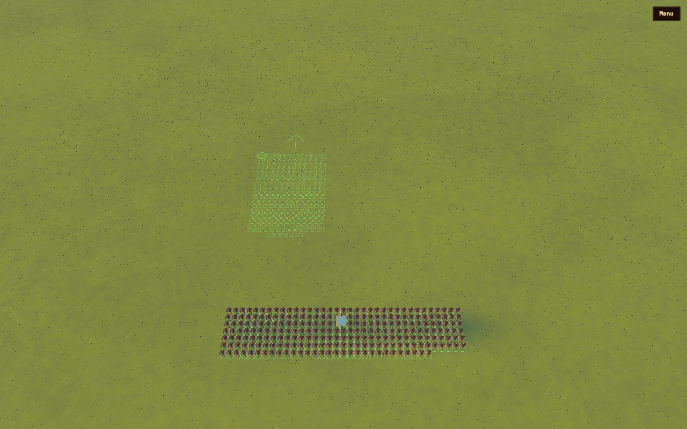
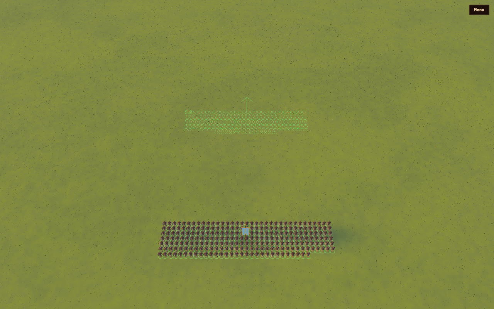

# Formation frontage dragging

Right-drag paints the front edge from its left corner. The cursor controls its
right edge; a left-to-right stroke faces forward, with ranks extending behind
it. The corner marker and forward arrow make that interpretation visible while
holding the mouse. Width snaps to whole soldier files within the simulation's
formation limits. Longer lines use more files and fewer ranks.

For multiple units, the layout preserves their lateral order, shares frontage
in proportion to their existing widths, and leaves spacing between blocks.
Minimum widths are reserved before distributing the remainder. A line shorter
than the combined legal minimum shows the minimum layout. Blocked destinations
resolve to passable ground in both the preview and accepted order.

The simulation owns the layout used by both the preview and released order.
The browser supplies the fixed ground-space press point and current/release
endpoint. Camera motion during a held drag does not move the press anchor.
Queued placements retain their own width until they execute; a preceding
placement finishes its arrival turn before the next one starts. Replacing one
member's order leaves the other members of a group attack active.

## History and review

The input implementation inspected back to `c34ea56e` (July 2026) treats a
right-drag as a direction arrow at a fixed center. Resizing existed as `set_files`
but was exposed through debug commands, not that input path. The recent camera
work restored the button binding to that old direction-only action; its checks
did not establish frontage resizing. This is the missing interaction, rather
than a width operation removed by the latest camera calibration.

Independent review found four issues in the initial implementation, all fixed:
arrival pivots displaced the ordered front edge; minimum-width allocation could
overrun a short line; detaching one attacker discarded unselected members; and
blocked-ground previews disagreed with accepted destinations. Arrival rotation
now uses the front anchor and its corresponding turn radius. It retains the
existing movement arrival tolerance rather than snapping soldiers to positions.
A queued-order test also exposed arrival-facing consumption during command
transmission; a pending command now keeps its facing until the march and turn.

## Contract changes

The unit-info buffer is unchanged. The small formation-preview response packs
unit, destination, facing, living count, files and spacing; its consumer owns a
named field map. Queued orders now have named fields plus optional formation
files, applied when the order starts. File limits use surviving men so the
advertised width does not immediately shrink under the casualty depth rule.

## CHANGE LEDGER

| Test | Previous behavior | New behavior | Why |
| --- | --- | --- | --- |
| `input.test.ts`: right drag | Forwarded a press-center and direction angle; the new forward-facing check failed with perpendicular dot product approximately zero. | Forwards the fixed front-edge endpoints to the formation command without rotating the camera. | Wires the requested frontage gesture. **moved** |
| `input.test.ts`: anchor and release | Reprojected the press pixel each move and used the last mousemove endpoint. | Retains the original ground point through camera movement and uses the release endpoint. | Keeps the left corner fixed. **added** |
| `mechanics_formation`: dragged frontage | No public front-edge command. | Checks 12 m and 24 m strokes for left corner, width, facing and matching accepted order. | Pins geometry through the simulation API. **added** |
| `mechanics_formation`: queued frontage | Queue stored destination and facing only. | Stores width; waits for the preceding arrival turn, then executes and reaches its own destination/facing. | Resizing belongs to the queued placement. **added** |
| `mechanics_formation`: group frontage | No shared line allocation. | Preserves lateral order, spacing and total extent in both drag directions. | Places selected units across one front edge. **added** |
| `mechanics_formation`: damaged frontage | Limits used the original headcount and a four-file floor. | Six survivors form two files and retain that width after ticking. | Makes the preview agree with the casualty depth constraint. **moved** |
| `mechanics_formation`: large arrival turn | Painted left corner ended near `(51.07, 7.23)` for `(60, 0)`. | Remains within the configured 1.5 m arrival radius plus numerical margin and faces the painted direction. | Pivots about the front anchor instead of moving it around the center. **moved** |
| `mechanics_formation`: mixed minimum widths | Two differently sized units exceeded a 12 m line, reaching 13.5 m. | A legal allocation fits within the line and one file's rounding interval. | Reserves minimum frontage before proportional allocation. **moved** |
| `mechanics_formation`: blocked ground | Preview `(45.85, 50)` became destination `(39.77, 43.37)` on release. | Preview and accepted passable destination agree. | Both call the terrain destination resolver. **moved** |
| `battle-terrain-controls`: drag preview/order | Checked rotation about the press point with unchanged width. | Extending the held drag increases files and width, preserves the left front corner, and issues matching width/normal facing at DPR 2. | Tests the requested operation through real mouse input. **moved** |
| `battle-formation-orders`: selective replacement | Replacing one attack-group member also dropped the other's attack intent; both ended in Move. | Replaced member remains Move; unselected member receives Attack. | Detaches members instead of discarding the entire group. **moved** |
| `battle-formation-drag`: captures | No width-changing visual gate. | Captures narrow and wide frontage with the same ground anchor. | Pins the visible gesture. **added** |

No class or weapon stats changed. The existing battle golden hash remains
unchanged. The focused formation, queued-order, settling and AI checks pass,
alongside the frontend tests and real-browser input checks.

The visual fixture uses fixed successive ticks for its two input states: the
frozen renderer otherwise retains its previous presented frame when only input
changes. These are gesture checkpoints, not a real-time movement recording.

Verification: 423 frontend tests, type checking, production build, rebuilt
Wasm, and 42 focused native checks passed (one existing ignored check).
Both canonical screenshots repeat with zero changed pixels. Compared with
the previous direction-only behavior, the narrow capture changes 7,452 pixels
and the wide capture changes 12,373 pixels.

Fresh independent inspection of both full images and enlarged crops confirmed
the shape change and ground alignment. Remaining presentation weaknesses are
the thin green rings' contrast against grass and fragmented edges at this
scale; the enlarged corner marker also competes with nearby soldier slots.
These belong to the overlay readability work, and remain visible in this
capture. No floating previews or missing soldier models were found.
